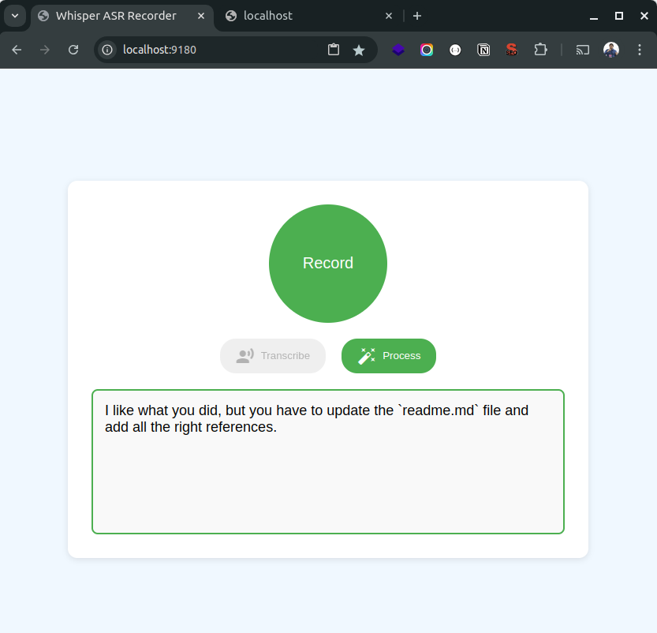

# Whisper ASR Box UI (with simple Mic-UI and LLM-based formatting)

A web-based user interface for [Whisper ASR Webservice](https://github.com/ahmetoner/whisper-asr-webservice) that combines speech recognition with LLM post-processing.

This means - **everything is locally hosted**.

## Features

- 🎤 Browser-based audio recording
- 🔄 Real-time transcription using Whisper ASR
- ✨ Automatic text formatting and correction using Ollama
- 📋 One-click copy to clipboard (or actually no-click, it's automatic)
- 🎯 Support for retry on failed transcriptions
- 💫 Clean, responsive UI with status indicators

## Preview



## Prerequisites

- Docker and Docker Compose
- NVIDIA GPU with CUDA support (recommended)
- [Ollama](https://ollama.ai/) running locally with Qwen2.5 model (you can use any model - just tweak the HTML)

## Quick Start

1. Clone this repository:
```bash
git clone https://github.com/HumanFace-Tech/whisper-asr-with-ui.git
cd whisper-asr-with-ui
```

2. Start the services:
```bash
docker-compose up -d
```

3. Access the web interface:
- Open `http://localhost:9180` in your browser

## Architecture

This project consists of three main components:

1. **Frontend**: Simple HTML/JS interface for audio recording and display (written mostly by AI)
2. **Whisper ASR Service**: Based on [ahmetoner/whisper-asr-webservice](https://github.com/ahmetoner/whisper-asr-webservice)
3. **Ollama Integration**: Local LLM for local text post-processing ;)

## Configuration

### Docker Compose Environment Variables

```yaml
whisper-asr-webservice:
  environment:
    - ASR_MODEL=base.en      # Choose model size
    - ASR_ENGINE=faster_whisper
```

### Port Configuration

- Web Interface: `9180`
- ASR Service: `9100`
- Ollama Service: `11434` (default)

## Development

To modify the web interface:
1. Edit `index.html` in the root directory
2. The changes will be reflected immediately through the Nginx server

## Credits
- [HumanFace Tech](http://humanfacetech.com/) - Author
- [Sergiu Nagailic - aka - Nikro](nikro.me) - Author
- [Whisper ASR Webservice](https://github.com/ahmetoner/whisper-asr-webservice) by Ahmet Öner
- [Ollama](https://ollama.ai/) for local LLM processing
- [Material Icons](https://fonts.google.com/icons) for UI elements

## License

This project is licensed under the MIT License - see the LICENSE file for details.